# 5.3 System Map

This section presents a visual overview of the EcoLink system structure. It shows the main pages and modules of the platform and how they are connected through the user flow. EcoLink is a B2B sustainability platform where supplier factories publish industrial waste materials and buyer factories search for these materials, send purchase requests, negotiate, place orders, complete payment, and review completed deals.

An SVG version of this system map is available at [ecolink-system-map.svg](./ecolink-system-map.svg), and the standalone Mermaid source is available at [ecolink-system-map.mmd](./ecolink-system-map.mmd).

```mermaid
flowchart TB
    %% EcoLink 5.3 System Map - Pages and Modules

    classDef root fill:#2E7D32,stroke:#1B5E20,stroke-width:2px,color:#FFFFFF
    classDef public fill:#E8F5E9,stroke:#43A047,stroke-width:1.5px,color:#1B5E20
    classDef auth fill:#E0F2F1,stroke:#00897B,stroke-width:1.5px,color:#004D40
    classDef supplier fill:#F1F8E9,stroke:#558B2F,stroke-width:1.5px,color:#33691E
    classDef buyer fill:#E3F2FD,stroke:#1976D2,stroke-width:1.5px,color:#0D47A1
    classDef admin fill:#F3E5F5,stroke:#7B1FA2,stroke-width:1.5px,color:#4A148C
    classDef support fill:#FFFDE7,stroke:#9E9D24,stroke-width:1.5px,color:#3E3E00

    EcoLink["EcoLink Platform"]:::root

    Home["Home Page"]:::public
    Contact["Contact Page"]:::public
    Pricing["Pricing Page"]:::public
    Register["Registration"]:::auth
    Login["Login"]:::auth
    Forgot["Forgot Password"]:::auth
    Reset["Reset Password"]:::auth

    EcoLink --> Home
    Home --> Contact
    Home --> Pricing
    Home --> Register
    Home --> Login
    Login --> Forgot
    Forgot --> Reset

    Login --> SupplierDash
    Login --> BuyerDash
    Login --> AdminDash

    subgraph SupplierArea["Supplier Factory Area"]
        SupplierDash["Supplier Dashboard"]:::supplier
        SupplierProfile["Profile / Edit Profile"]:::supplier
        ManageListings["Manage Listings"]:::supplier
        CreateListing["Create Waste Listing"]:::supplier
        EditListing["Edit Listing"]:::supplier
        SupplierRequests["Purchase Requests"]:::supplier
        AcceptDecline["Accept / Decline Request"]:::supplier
        SupplierChat["Chat & Negotiation"]:::supplier
        SupplierDeals["Deal Details"]:::supplier
        SupplierNotifications["Notifications"]:::supplier
        SupplierEarnings["Earnings Overview"]:::supplier
    end

    SupplierDash --> SupplierProfile
    SupplierDash --> ManageListings
    ManageListings --> CreateListing
    ManageListings --> EditListing
    SupplierDash --> SupplierRequests
    SupplierRequests --> AcceptDecline
    AcceptDecline --> SupplierChat
    SupplierChat --> SupplierDeals
    SupplierDeals --> SupplierEarnings
    SupplierDash --> SupplierNotifications

    subgraph BuyerArea["Buyer Factory Area"]
        BuyerDash["Buyer Dashboard"]:::buyer
        BuyerProfile["Profile / Edit Profile"]:::buyer
        SearchListings["Search Listings"]:::buyer
        Filters["Search Filters"]:::buyer
        ListingDetails["Listing Details"]:::buyer
        SendRequest["Send Purchase Request"]:::buyer
        BuyerRequests["Requests Status"]:::buyer
        BuyerChat["Chat & Negotiation"]:::buyer
        Cart["Cart"]:::buyer
        Payment["Payment"]:::buyer
        BuyerDeals["Deal Details"]:::buyer
        BuyerNotifications["Notifications"]:::buyer
        BuyerReviews["Reviews"]:::buyer
    end

    BuyerDash --> BuyerProfile
    BuyerDash --> SearchListings
    SearchListings --> Filters
    SearchListings --> ListingDetails
    ListingDetails --> SendRequest
    SendRequest --> BuyerRequests
    BuyerRequests --> BuyerChat
    BuyerChat --> Cart
    Cart --> Payment
    Payment --> BuyerDeals
    BuyerDeals --> BuyerReviews
    BuyerDash --> BuyerNotifications

    subgraph AdminArea["Admin Area"]
        AdminDash["Admin Dashboard"]:::admin
        ManageUsers["Manage Users"]:::admin
        ModerateListings["Manage Listings"]:::admin
        AuditPayments["Payment Audit"]:::admin
        Commissions["Commissions"]:::admin
        CompletedDeals["Completed Deals"]:::admin
    end

    AdminDash --> ManageUsers
    AdminDash --> ModerateListings
    AdminDash --> AuditPayments
    AdminDash --> Commissions
    AdminDash --> CompletedDeals

    subgraph SupportLayer["Supporting System Components"]
        Backend["Backend APIs"]:::support
        Database[("Database")]:::support
        PaymentGateway["Payment Gateway"]:::support
        NotificationService["Notification Service"]:::support
        RealtimeService["Real-time Chat Service"]:::support
    end

    ManageListings -.-> Backend
    SearchListings -.-> Backend
    SupplierRequests -.-> Backend
    BuyerRequests -.-> Backend
    Cart -.-> Backend
    Payment -.-> Backend
    AdminDash -.-> Backend
    Backend -.-> Database
    Payment -.-> PaymentGateway
    SupplierNotifications -.-> NotificationService
    BuyerNotifications -.-> NotificationService
    SupplierChat -.-> RealtimeService
    BuyerChat -.-> RealtimeService
```

## Explanation

The EcoLink system map shows the platform as a set of connected pages and modules. The system starts from the EcoLink platform and home page, where users can access public pages such as contact and pricing, or move to registration and login. After login, the user is directed to the correct area based on role: Supplier Factory, Buyer Factory, or Admin.

The Supplier Factory area focuses on managing factory profile information, creating and editing waste listings, responding to buyer purchase requests, negotiating through chat, viewing deal details, tracking earnings, and receiving notifications. The Buyer Factory area focuses on managing profile information, searching listings, filtering results, viewing listing details, sending purchase requests, chatting with suppliers after accepted requests, adding agreed items to cart, completing payment, viewing deal details, receiving notifications, and reviewing suppliers.

The Admin area connects to the administrative modules used to manage the platform, including users, listings, payments, commissions, and completed deals. The supporting system components at the bottom show that the main pages communicate with backend APIs, which store and retrieve information from the database. External services support payment processing, notifications, and real-time chat. This map therefore represents the relationship between EcoLink users, pages, modules, backend services, database storage, and external services in a clean system overview suitable for graduation project documentation.
